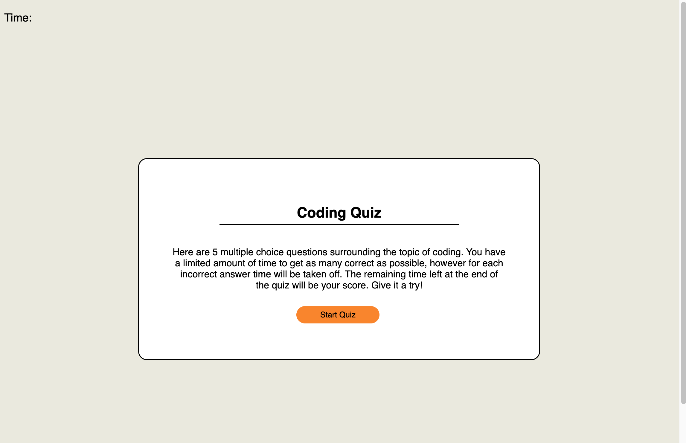
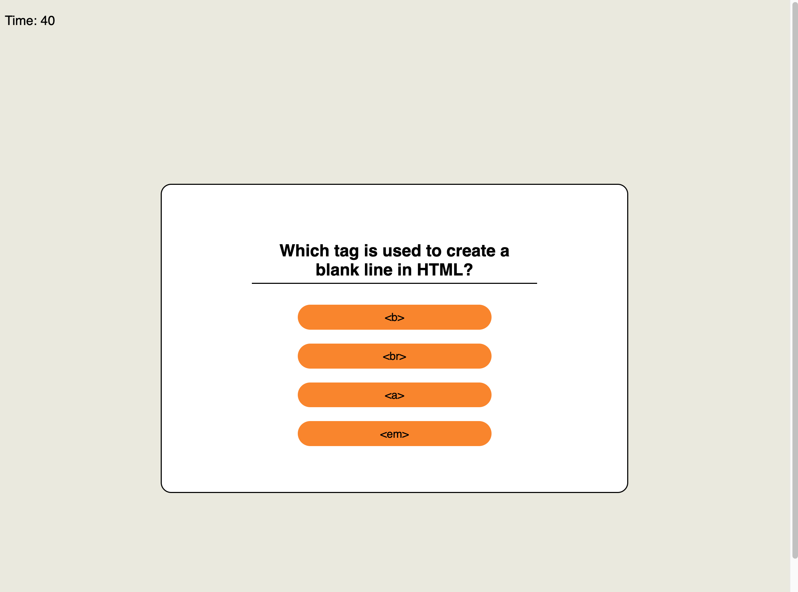
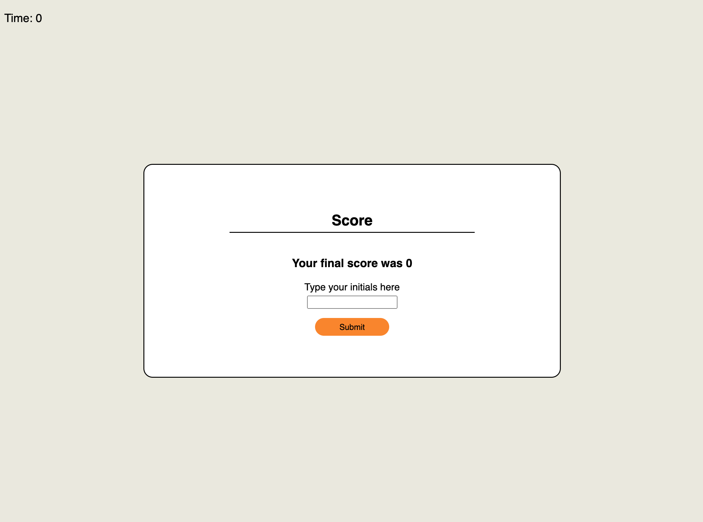
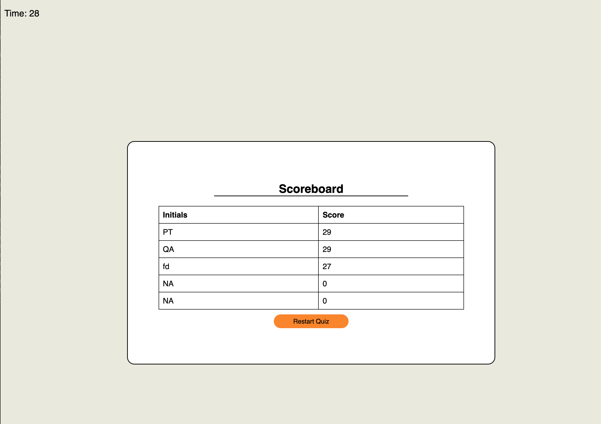

# <Coding-Quiz>

## Description
The reason behind producing this project was to better understand and use the more advanced components of Javascript to create a more dynamic and responsive project. A quiz allows for the user to interact with the site and the site to document, store and display the users interaction with the quiz through the scored time. In exercising the differing javascript components I came to better understand how the logic of javascript can produce more interactive and responsive elements in html but also change attributes traditionally located in css as well as building a logical chain of functions to control the structure of the quiz as it is interacted with. I learnt:
- how to append contents to a table to display stored arrays
- how use local storage to store an array of users
- how to turn on and off different html elements to control the display
- the implementation of a timer to both monitor score but also suffer penalties which reduce the time
- how to build an array of multiple components ranging between questions, choices and solutions and have that displayed through javascript

## Usage
This is the link to live github Pages site: https://nikoauer.github.io/Coding-Quiz/

## Credits
- https://stackoverflow.com/questions/58967352/creating-a-multiple-choice-quiz-with-array
- https://getcssscan.com/css-buttons-examples
- https://developer.mozilla.org/en-US/docs/Web/API/setInterval
- https://www.youtube.com/watch?v=riDzcEQbX6k&t=1427s
- https://www.sanfoundry.com/1000-html-questions-answers/
- https://dev.to/minna_xd/adding-a-high-score-table-to-javascript30-whack-a-mole-4adk
- https://michael-karen.medium.com/how-to-save-high-scores-in-local-storage-7860baca9d68